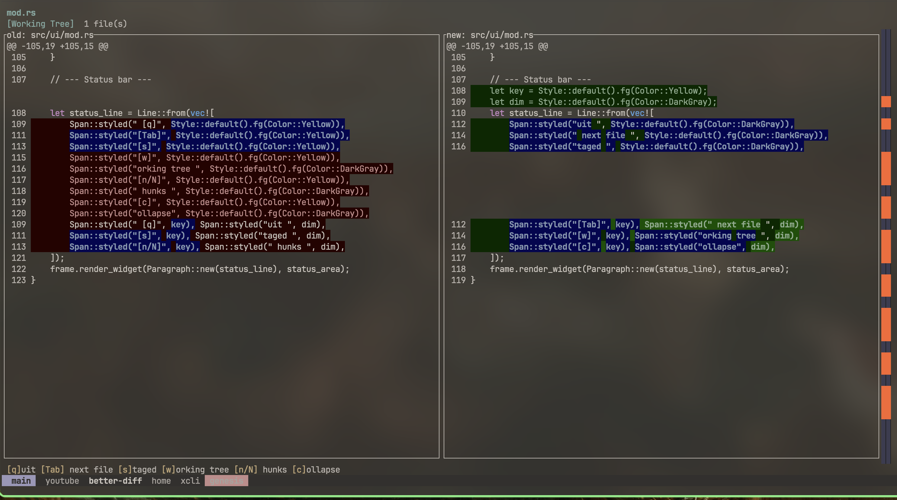

# better-diff

A Rust TUI program for visualizing git diffs with novel visualization features.



## Features

- **Side-by-side diff view** with file tabs
- **Token-level change highlighting** — word-level diffs within changed lines (not just line-level)
- **Structural folding** — AST-aware collapsing via tree-sitter
- **Block move detection** — detects moved code blocks with visual linking
- **Heat map minimap** — change density sidebar
- **Change animations** — subtle transitions on hunk focus
- **Two modes** — working tree vs HEAD, staged vs HEAD
- **Filesystem watching** — near-real-time updates via `notify`

## Install

```sh
cargo install --path .
```

## Usage

```sh
# View working tree changes
better-diff

# View staged changes
better-diff --staged

# View changes in a specific directory
better-diff /path/to/repo
```

## Keybindings

| Key | Action |
|---|---|
| `j`/`k` or arrows | Scroll line by line |
| `n`/`N` | Jump to next/previous hunk |
| `Tab`/`Shift+Tab` | Next/previous file |
| `1-9` | Jump to file by number |
| `s` / `w` | Staged / working tree mode |
| `c` | Cycle collapse level |
| `q` / `Esc` | Quit |

## Built With

- [Ratatui](https://ratatui.rs/) — TUI framework
- [git2](https://docs.rs/git2) — Git operations
- [similar](https://docs.rs/similar) — Word/char-level diffing
- [tree-sitter](https://tree-sitter.github.io/) — AST parsing & syntax highlighting
- [notify](https://docs.rs/notify) — Filesystem watching
